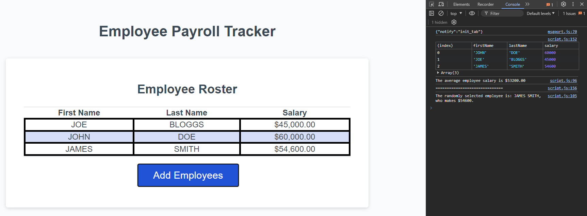
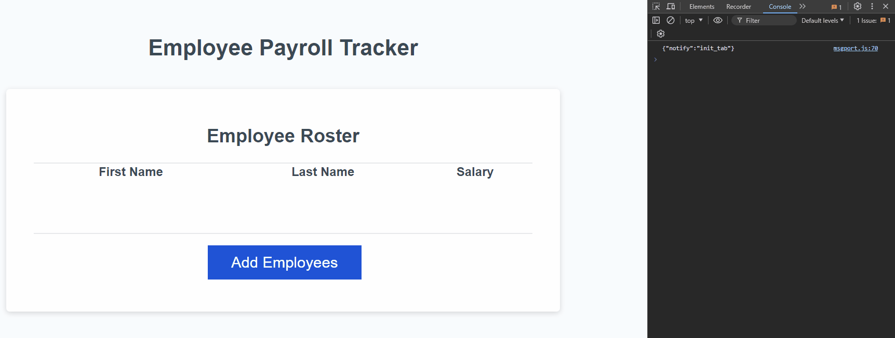

# payroll-managment-js

03-JavaScript/02-Challenge - using Javascript to build an employee payroll tracker/payroll management software.

## Description

Module 3 - JavaScript: Payroll Management Software

Development of JavaScript code to create a employee payroll management system, through the execution of the following:

- clickable button to begin the data entry process
- mathematical calculations that are logged to the console
- sorting the employee data alphabetically
- ensuring data input is not left blank
- ensuring salary is input as a number
- addition of comments to improve readability

Project executed in accordance with the following challenge requirements:

### User Story

```md
AS A payroll manager
I WANT AN employee payroll tracker
SO THAT I can see my employees' payroll data and properly budget for the company
```

### Acceptance Criteria

```md
GIVEN an employee payroll tracker
WHEN I click the "Add employee" button
THEN I am presented with a series of prompts asking for first name, last name, and salary
WHEN I finish adding an employee
THEN I am prompted to continue or cancel
WHEN I choose to continue
THEN I am prompted to add a new employee
WHEN I choose to cancel
THEN my employee data is displayed on the page sorted alphabetically by last name, and the console shows computed and aggregated data
```

## Table of Contents

- [Installation](#installation)
- [Usage](#usage)
- [Credits](#credits)
- [License](#license)

## Installation

Git and an IDE (VSCode recommended) are required to be installed on your computer to clone and view the code for this web application.

From your command line:

```md
### Clone this repository
$ git clone git@github.com:ajhearne-mZAOSW/payroll-management-js.git

### Navigate into the repository
$ cd payroll-management-js

### Open in IDE
$ code .
```

## Usage

The following image shows the web application's appearance and functionality:





The web application is depoloyed using GitHub Pages: (<https://ajhearne-mzaosw.github.io/payroll-management-js/>).

## Credits

- Source starter code provided by University of Sydney, USYD-VIRT-FSF-PT-05-2024-U-LOLC/03-JavaScript/02-Challenge/Develop

## License

MIT
